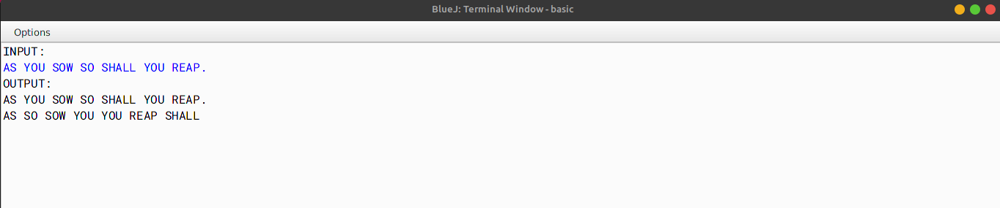

# ALGORITHM

- Step-1 :- START
- Step-2 :- Create a class named as `check`.
- Step-3 :- Create a function named as `sen_check` and pass the string type parameter `sen`. In this function, create a string tokenizer object and pass the string `sen` and the delimiter as `? .!,`. Create a variable `count` to store the number of tokens. Create a string type array `a[]` and now using a for loop (from 0 to `count`) and store the tokens in the string type array `a[]`. Create a for loop (from 0 to the length of the array), start a inner loop (from 0 to `a.length-1-i`) and check whether `a[j].compareTo(a[j+1])>0` is true then swap the adjacent elements.Create a for loop (from 0 to the length of the array), start a inner loop (from 0 to `a.length-1-i`) and check whether `a[j].length() > a[j + 1].length()`, if true then swap them if they are not in the desired order. Now print the sorted array.
- Step-4 :- Create a function named as `main`. In this function, create a string type variable `sen` and store the sentence in it (user input). Call the function `sen_check` and pass the string `sen` as the parameter.
- Step-5 :- END

# VD TABLE

| Sr. No. | Variable | Data Type | Description |
| --- | --- | --- | --- |
| 1 | i | int | To store the value of the loop variable |
| 2 | j | int | To store the value of the loop variable |
| 3 | count | int | To store the number of tokens |
| 4 | a[] | String | To store the tokens |
| 5 | sen | String | To store the sentence |
| 6 | temp | String | To store the temporary value |
| 7 | last | char | To store the last character of the sentence |
| 8 | len | int | To store the length of the sentence |

# OUTPUT

