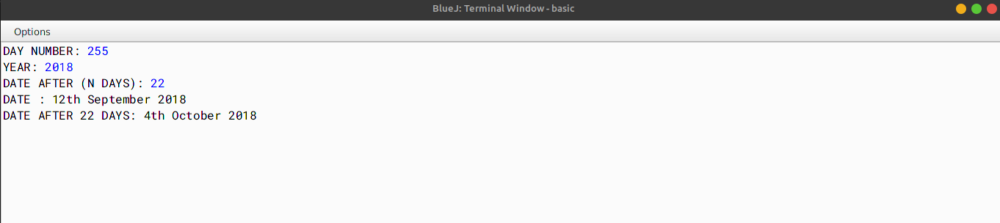

# ALGORITHM

- Step-1 :- START
- Step-2 :- Create a class named as `days`.
- Step-3 :- Create a method named as `main` and declare the Scanner class. Declare the variables- `n`,`day`,`year`- of integer type to store the number of days, calculated days and year respectively. Create an array named `a` of integer type in order to store the names of the 12 months orderwise. Check whether the year entered is a leap year or not, if true then store the number of days in the month of February as 29 else store it as 28. Using multiple for-loops store the calculated days in the variable `day` and the year in the variable `year`. Finally print the calculated date,month and y
- Step-4 :- END

# VD TABLE

| Sr. No. | Variable | Data Type | Description |
| --- | --- | --- | --- |
| 1 | n | int | To store the number of days |
| 2 | day | int | To store the days |
| 3 | year | int | To store the year |
| 4 | a | int[] | To store the names of the 12 months orderwise |
| 5 | i | int | Used in for-loop |
| 6 | j | int | Used in for-loop |
| 7 | k | int | Used in for-loop |
| 8 | nday | int | To store the calculated day number |
| 9 | date | int | To store the calculated date |

# OUTPUT

