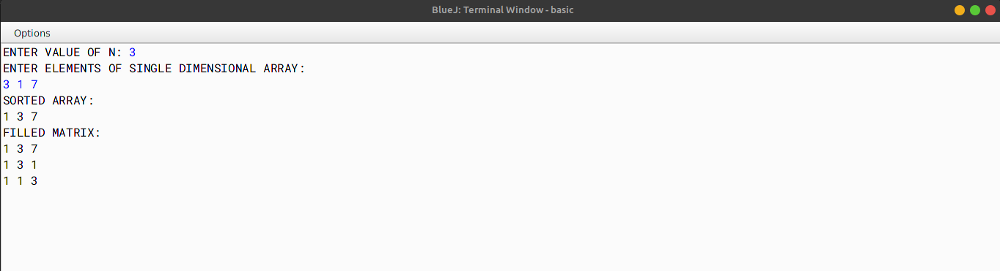

# ALGORITHM

- Step-1 :- START
- Step-2 :- Create a class named as `sort`.
- Step-3 :- Create a method named as `sort` and pass the integer type array `a[]` as parameter. In this function, create a for loop (from 0 to the length of the array), start a inner loop (from 0 to `a.length-1-i`) and check whether `a[j] > a[j + 1]`, if true then swap them if they are not in the desired order. 
- Step-4 :- Create a method named as `main`. In this function, create an integer type array `a[]` and store the elements in it (user input). Call the function `sort` and pass the array `a[]` as the parameter. Print the sorted array. Create a 2-Dimensional array `b[][]` and store the elements of sorted array `a[]` in the required pattern using for-loops. Now print the 2-Dimensional array `b[][]`.
- Step-5 :- END

# VD TABLE

| Sr. No. | Variable | Data Type | Description |
| --- | --- | --- | --- |
| 1 | i | int | To store the value of the loop variable |
| 2 | j | int | To store the value of the loop variable |
| 3 | a | int[] | To store the elements of the array |
| 4 | b | int[][] | To store the elements of the array in the required pattern |
| 5 | n | int | To store the size of the array |
| 6 | temp | int | To store the temporary value |
| 7 | k | int | To store the value of the loop variable |
| 8 | r | int | To store the value of the loop variable |

# OUTPUT

