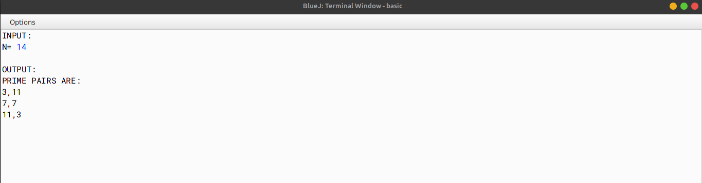

# ALGORITHM

- Step-1 :- START
- Step-2 :- Create a class named as `goldbach`.
- Step-3 :- Create a method named as `even` of type boolean and pass an integer named `n` as a parameter. In this function, check whether the number is even or not.
- Step-3 :- Create a method named as `odd_prime` of type boolean and pass an integer named `n` as a parameter. In this function, first call the function `even` and check whether the number is even or not. If the number is not even then check whether the number is prime or not.
- Step-4 :- Create a method named as `main`. In this function, first take an integer input from the user and store it in a variable named `n`. Now call the function `even` and check the required, then call the function `odd_prime` and check whether the number is prime or not. Create two for-loops (from 1 to n and from 1 to i(variable of the outer loop)), now check whether the both the loop variables is prime or not by calling the function `odd_prime` and passing the loop variable as parameter. If the number is prime then print the number.
- Step-5 :- END

# VD TABLE

| Sr. No. | Variable | Data Type | Description |
| --- | --- | --- | --- |
| 1 | n | int | To store the input number |
| 2 | i | int | To store the value of the outer loop |
| 3 | j | int | To store the value of the inner loop |
| 4 | k | int | Used as counter variable |
| 5 | c | int | Used as counter variable |

# OUTPUT

