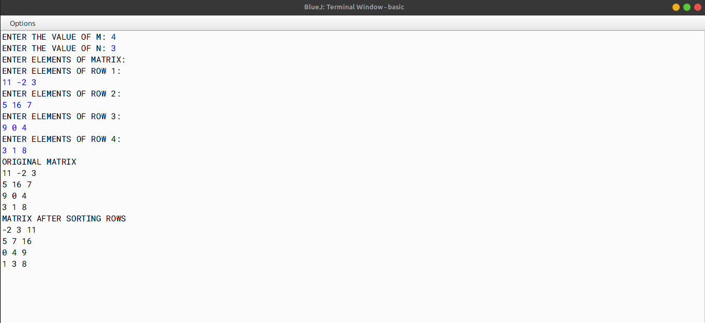

# ALGORITHM

- Step-1 :- START
- Step-2 :- Create a class named as `sort`.
- Step-3 :- Create a method named as `main`. In this function, create variables named as `m` and `n` to store the number of rows and columns of the matrix respectively. Now check whether number of rows and columns are valid or not. If not, then print `Invalid Input` and terminate the program. Otherwise, continue. Create a 2D array named as `a[][]` of size `m` and `n` and using for loops take the array input. Now print the original array. Now create two for loops to traverse the array. In the inner loop, check whether the current element is greater than the next element or not. If yes, then swap the elements. Now print the sorted array.
- Step-4 :- END

# VD TABLE 

| Sr. No. | Variable | Data Type | Description |
| --- | --- | --- | --- |
| 1 | m | int | To store the number of rows of the matrix |
| 2 | n | int | To store the number of columns of the matrix |
| 3 | arr | int[][] | To store the elements of the matrix |
| 4 | i | int | To store the value of the current row |
| 5 | j | int | To store the value of the current column |
| 6 | t | int | To store the value of the current element |

# OUTPUT

