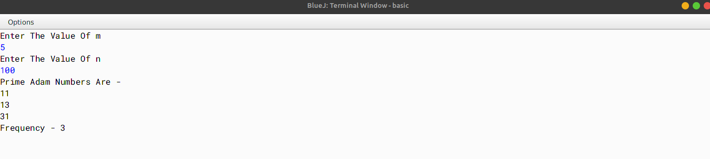

# ALGORITHM

- Step-1 :- START
- Step-2 :- Create a class named as `prime_adam`.
- Step-3 :- Create a function named as `isPrime` which takes an integer as an argument and returns a boolean value. In this function, first initialize the counter to 0 and then start a for loop (from 1 to the given number) and check if the given number is divisible by the current number in the loop. If it is divisible, then increment the counter by 1. If the counter is greater than 2, then return False. Else, return True.
- Step-4 :- Create a function named as `reverse` which takes an integer as an argument and returns an integer. In this function, first initialize the variable `rev` to 0. Then, start a while loop and in each iteration, multiply the `rev` by 10 and add the remainder of the given number divided by 10 to it. Then, divide the given number by 10. Repeat this until the given number becomes 0. Finally, return the `rev`.
- Step-5 :- Create a function named as `isAdam` which takes an integer as an argument and returns a boolean value. In this function, first check if the given number is prime or not. If it is not prime, then return False. Else, check if the reverse of the square of the given number is equal to the square of the reverse of the given number. If it is equal, then return True. Else, return False.
- Step-6 :- Create a function named as `main` to call the methods and print the result. In this function, first initialize the variable `m` and `n` using Scanner Class. Then, start a for loop (from `m` to `n`) and check if the current number in the loop is an Adam number or not. If it is an Adam number, then print it.
- Step-7 :- END

# VD TABLE 

| Sr. No. | Variable | Data Type | Description |
| --- | --- | --- | --- |
| 1 | x | int | To store the number |
| 2 | r | int | To store the reverse of the number |
| 3 | s1 | int | To store the square of the number |
| 4 | s2 | int | To store the square of the reverse of the number |
| 5 | i | int | To store the value of the loop variable |
| 6 | c | int | Used As Counter Variable  |
| 7 | count | int | Used As Counter Variable |
| 8 | m | int | To store the upper limit for the loop |
| 9 | n | int | To store the lower limit for the loop |

# OUTPUT

