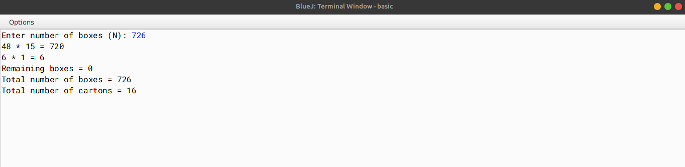

# ALGORITHM

- Step-1 :- START
- Step-2 :- Create a class named as `boxes`.
- Step-3 :- Create a method named as `main`. In this function, create a variable named as `n` to store the number of boxes. Check if the number of boxes is greater than 0 and less than 1000 or not, if true then print `Invalid Input` and exit the program. Create an array named as `cartonSizes` to store the various sizes of the boxes. Create a for-loop (from 0 to length of `cartonSizes`) inside which calculate and print the volume of each box size. Print the total volume of all the boxes.
- Step-4 :- END

# VD TABLE

| Sr. No. | Variable | Data Type | Description |
| --- | --- | --- | --- |
| 1 | n | int | To store the number of boxes |
| 2 | cartonSizes | int[] | To store the various sizes of the boxes |
| 3 | i | int | To store the index of the array |
| 4 | cartonCount | int | To store the volume of each box size |
| 5 | total | int | To store the total number of all the boxes |
| 6 | t | int | Used as temporary variable |

# OUTPUT

