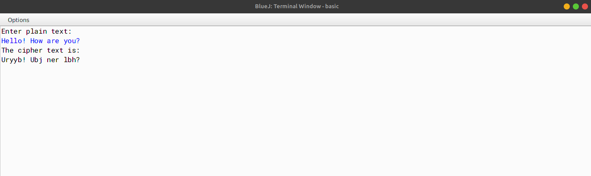

# ALGORITHM

- Step-1 :- START
- Step-2 :- Create a class named as `CaesarCipher`.
- Step-3 :- Create a method named as `main`. In this function, create a variable named as `text` and assign a string value to it from the user (using Scanner class) which stores the plain text. Create a StringBuffer object named as `sb`. Create a for loop (from 0 to length of the string), inside this create a variable `ch` of type char and store each character of string `text`, now check the condition if the character `ch` is between `A-M`, if true then `append((char)(ch+13))` to `sb`, else if the character `ch` is between `N-Z`, if true then `append((char)(ch-13))` to `sb`, else `append(ch)` to `sb`. Now store the value of `sb` in a string variable named as `cipher` and print it.
- Step-4 :- END

# VD TABLE

| Sr. No. | Variable | Data Type | Description |
| --- | --- | --- | --- |
| 1 | text | String | Stores the plain text |
| 2 | sb | StringBuffer | Stores the cipher text |
| 3 | ch | char | Stores the character of the string |
| 4 | cipher | String | Stores the cipher text |
| 5 | i | int | Stores the index of the string |
| 6 | len | int | Stores the length of the string |

# OUTPUT

