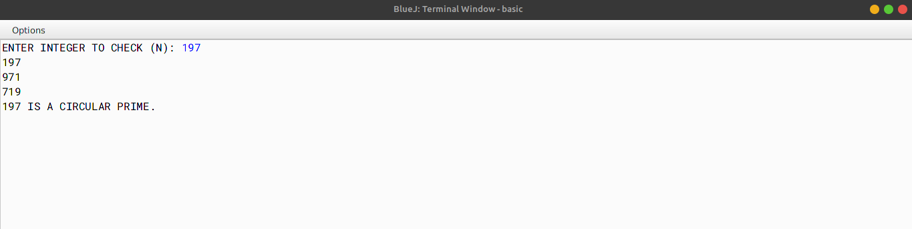

# ALGORITHM

- Step-1 :- START
- Step-2 :- Create a class named as `"Check"`.
- Srep-3 :- Create a constructor to initialize the instance variable String *wrd* with null, int *len* with 0.
- Step-4 :- Create a *void* method `"acceptword"` to input a word in *wrd* and and count the length of the word and store in *len*.
- Step-5 :- Create a *boolean* method `"palindrome"` to check if the word is palindrome or not by checking the first and the last leter of the word i.e. palinedrome words will have first and last letter common.
- Step-6 :- Create a *void* method `"display"` to print if the entered word is palindrome or not by checking the result of the *boolean* `"palindrome"`.
- Step-7 :- Create the `"main"` method to create a object and call `"acceptword"` and `"display"` methods.
- Step-8 :- END

# VD TABLE

| Sr. No. | Variable | Data Type | Description |
| --- | --- | --- | --- |
| 1 | wrd | String | Stores the input word |
| 2 | len | int | Stores the len of the input word |
| 3 | i | int | To iterate the for-loop for checking palindrome |
| 4 | j | int | To iterate the for-loop for checking palindrome |

# OUTPUT

