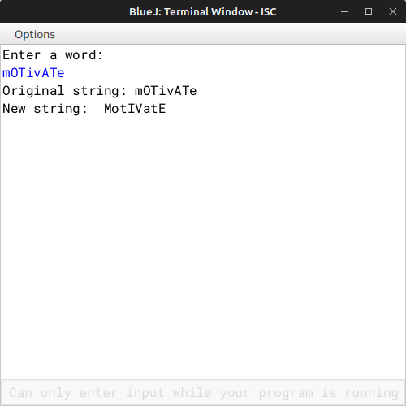

# ALGORITHM

- Step-1 :- START
- Step-2 :- Create a class named as `"Toggle"`.
- Srep-3 :- Create a constructor to initialize the instance variable String str and newstr with null, int len with 0.
- Step-4 :- Create a *void* method `"readword"` to input a word in *str* and and count the length of the word and store in *len*.
- Step-5 :- Create a *void* method `"toggle"` to go through the whole word and check if the letter is uppercase or lowercase and convert it to its opposite case.
- Step-6 :- Create a *void* method `"display"` to print the original and the new word.
- Step-7 :- Create the `"main"` method to create a object and call `"readword"`, `"toggle"` and `"display"` methods.
- Step-8 :- END

# VD TABLE

| Sr. No. | Variable | Data Type | Description |
| --- | --- | --- | --- |
| 1 | str | String | Stores the input word |
| 2 | newstr | String | Stores the new toggled word |
| 3 | len | int | Stores the len of the input word |
| 4 | i | int | To iterate the for-loop for going through the word |

# OUTPUT

