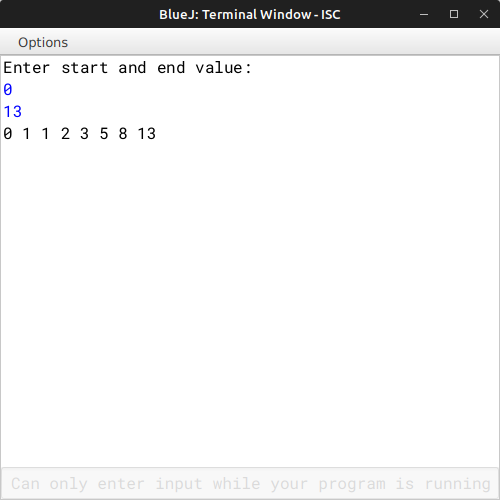

# ALGORITHM

- Step-1 :- START
- Step-2 :- Create a class named as `"Fibo"`.
- Srep-3 :- Create a constructor to initialize the instance variable int *start* and *end* with 0.
- Step-4 :- Create a *void* method `"read()"` to input the start and end value for the series.
- Step-5 :- Create a *int* method `"fibo(int n)"` to return the nth term of a Fibonacci series using recursive technique.
- Step-6 :- Create a *void* method `"display()"` to displays the Fibonacci series from start to end by invoking the function *fibo()*.
- Step-7 :- Create the `"main"` method to create a object and call `"read"` and `"display"` methods.
- Step-8 :- END

# VD TABLE

| Sr. No. | Variable | Data Type | Description |
| --- | --- | --- | --- |
| 1 | start | int | Store the start value |
| 2 | end | int | Store the end value |
| 3 | n | int | Formal parameter for method *fibo()* |
| 4 | i | int | To iterate the for-loop for printing the series int *display()* |

# OUTPUT

