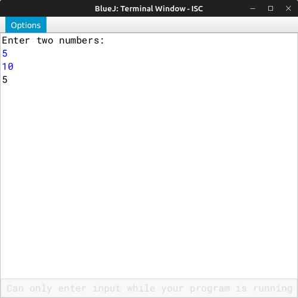

# ALGORITHM

- Step-1 :- START
- Step-2 :- Create a class named as `"Gcd"`.
- Srep-3 :- Create a constructor to initialize the instance variable int *num1* and *num2* with 0.
- Step-4 :- Create a *void* method `"accept"` to accept two nos. in *num1* and *num2* respectively.
- Step-5 :- Create a *int* method `"gcd"` to calculate the gcd of the two nos. using recursive technique.
- Step-6 :- Create a *void* method `"display"` to print the gcd of the two nos.
- Step-7 :- Create the `"main"` method to create a object and call `"accept"` and `"display"` methods.
- Step-8 :- END

# VD TABLE

| Sr. No. | Variable | Data Type | Description |
| --- | --- | --- | --- |
| 1 | num1 | int | Stores the first no. |
| 2 | num2 | int | Stores the second no. |
| 3 | x | int | Formal parameter for function *gcd()* |
| 4 | y | int | Formal parameter for function *gcd()* |
| 5 | temp | int | Temporary variable for swaping *num1* and *num2* in *display()*, if *num1* is smaller than *num2* |

# OUTPUT

