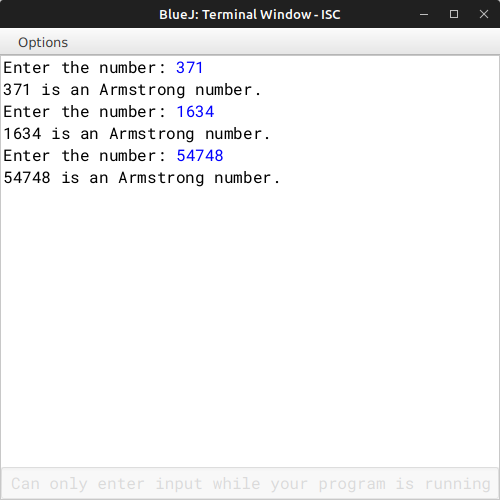

# ALGORITHM

- Step-1 :- START
- Step-2 :- Create a class named as `"ArmNum"`.
- Srep-3 :- Create a parameterized constructor to initialize the instance variable int *n* with *int num*.
- Step-4 :- Create a *int* method `"sum_pow"` calculate the sum of the power of the digit to the length of digit, using recursive technique.
- Step-5 :- Create a *void* method `"isArmstrong"` to check the no. is Armstorm and prints the appropriate message.
- Step-6 :- Create the `"main"` method to input the no. and create a object and call `"isArmstrong"` methods.
- Step-7 :- END

# VD TABLE

| Sr. No. | Variable | Data Type | Description |
| --- | --- | --- | --- |
| 1 | n | int | Stores the no. |
| 2 | l | int | Stores the length of the no. |
| 3 | nn | int | Parameter for the parameterized construtor *ArmNum(int nn)* |
| 4 | c | int | Looping variable to count the length of the no. |
| 5 | i | int | Formal parameter for *sum_pow(int i)* |

# OUTPUT

