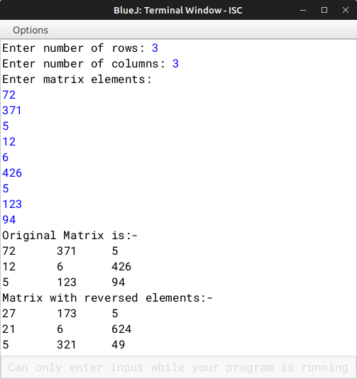

# ALGORITHM

- Step-1 :- START
- Step-2 :- Create a class named as `"MatRev"`.
- Srep-3 :- Create a parameterized constructor to initialize the instance variable int *m* and *n* and also initialize *arr* with *m* & *n*.
- Step-4 :- Create a *void* method `"fillArray"` to accept elements in the array *arr[m][n]*.
- Step-5 :- Create a *int* method `"reverse"` to reverse any no.
- Step-6 :- Create a *void* method `"revMat"` to reverse the matrix with the help of `"reverse"`.
- Step-7 :- Create a *void* method `"show"` to display a matrix.
- Step-8 :- Create the `"main"` method to input the no. of rows and columns and create two objects *obj1* & *obj2* then take input in one array and fill the other array with the reverse integers of the first array, then print both.
- Step-9 :- END

# VD TABLE

| Sr. No. | Variable | Data Type | Description |
| --- | --- | --- | --- |
| 1 | arr[][] | int | A array to store integers in *m* rows and *n* columns |
| 2 | m | int | Stores no. of rows |
| 3 | n | int | Stores no. of columns |
| 4 | mm | int | Parameter for no. of rows in *MatRev(int mm, int nn)* |
| 5 | nn | int | Parameter for no. of columns in *MatRev(int mm, int nn)* |
| 6 | i | int | Looping variable in *fillArray()* & *show()* |
| 7 | j | int | Looping variable in *fillArray()* & *show()* |
| 8 | rev | int | Store the reverse of a no. |
| 9 | x | int | Store the user input no. of rows. |
| 10 | y | int | Store the user input no. of columns. |

# OUTPUT

