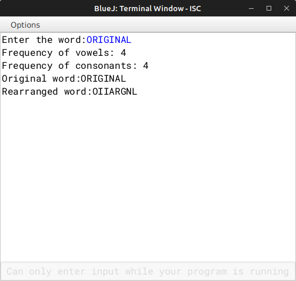

# ALGORITHM

- Step-1 :- START
- Step-2 :- Create a class named as `"Rearrange"`.
- Srep-3 :- Create a constructor to initialize the instance variable String *wrd* and *newwrd* with null.
- Step-4 :- Create a *void* method `"readword"` to accept the word and convert its case to Uppercase.
- Step-5 :- Create a *void* method `"freq_vow_con"` to count the frequency of vowels and consonants.
- Step-6 :- Create a *void* method `"arrange"` to arrange the letters by bringing the vowels at the beginning followed by consonants.
- Step-7 :- Create a *void* method `"display"` to display the original and the rearranged word.
- Step-8 :- Create the `"main"` to make a object and call `"readword"`, `"freq_vow_con"`, `"arrange"`, and `"display"`.
- Step-9 :- END

# VD TABLE

| Sr. No. | Variable | Data Type | Description |
| --- | --- | --- | --- |
| 1 | wrd | String | Store the input word |
| 2 | newwrd | String | Store the rearranged word |
| 3 | v | int | Stores no. of vowels |
| 4 | c | int | Stores no. of consonants |
| 5 | v | String | Stores all the vowels of the word |
| 6 | c | String | Stores all the consonants of the word |
| 7 | i | int | Looping variable in *freq_vow_con()* & *arrange()* |

# OUTPUT

