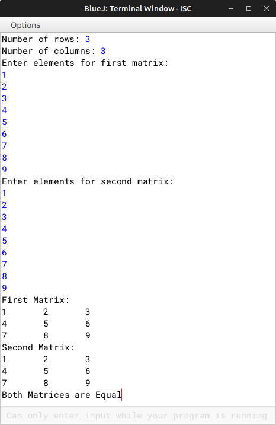

# ALGORITHM

- Step-1 :- START
- Step-2 :- Create a class named as `"EqMat"`.
- Srep-3 :- Create a parameterized constructor to initialize the instance variable int *m*, *n* and *a[][]* with *mm*, *nn* and *a[][]* with *m* and *n*.
- Step-4 :- Create a *void* method `"readArray"` to input the elements of the arrays.
- Step-5 :- Create a *boolean* method `"check"` to check if the elements of the array are equal or not.
- Step-6 :- Create a *void* method `"print"` to print a matrix.
- Step-7 :- Create the `"main"` to user input the rows and columns for the matrixes and create two object for two matrixes and take input in those two matrix and print both matrixes and check if they are equal or not and print a appropriate message.
- Step-8 :- END

# VD TABLE

| Sr. No. | Variable | Data Type | Description |
| --- | --- | --- | --- |
| 1 | m | int | Store the no. of rows |
| 2 | n | int | Store the no. of columns |
| 3 | mm | int | Constructor parameter for no. of rows |
| 4 | nn | int | Constructor parameter for no. of columns |
| 5 | a[][] | int | Array to store the matrix of *m* rows and *n* columns |
| 6 | i | int | Looping variable in *readArray()*, *check(EqMat p, EqMat q)*, and *print()* |
| 7 | j | int | Looping variable in *readArray()*, *check(EqMat p, EqMat q)*, and *print()* |
| 8 | rows | int | Store the user input of rows |
| 9 | columns | int | Store the user input of columns |

# OUTPUT

