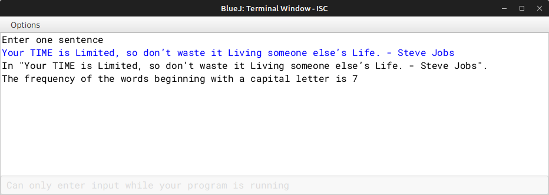

# ALGORITHM

- Step-1 :- START
- Step-2 :- Create a class named as `"Capital"`.
- Srep-3 :- Create a parameterized constructor to initialize the instance variable String *sent* with null,and int *freq* with 0.
- Step-4 :- Create a *void* method `"input()"` to input the sentence.
- Step-5 :- Create a *boolean* method `"isCap(String w)"` to check if the first letter of the sentence is capital or not.
- Step-6 :- Create a *void* method `"display()"` to count the no. of words and check if the words starts with a capital letter or not with the help of *isCap(String w)*.
- Step-7 :- Create the `"main"` to create a object and call the `"input()"` & `"output()"` method.
- Step-8 :- END

# VD TABLE

| Sr. No. | Variable | Data Type | Description |
| --- | --- | --- | --- |
| 1 | sent | String | Store the input string |
| 2 | freq | int | Store the no. of words in the String |
| 3 | ct | int | Count the no. of words |
| 4 | w | String | Formal parameter for *isCap(String w)* method |
| 5 | i | int | Looping variable in *display()* for going through each word in the string and check them |

# OUTPUT

