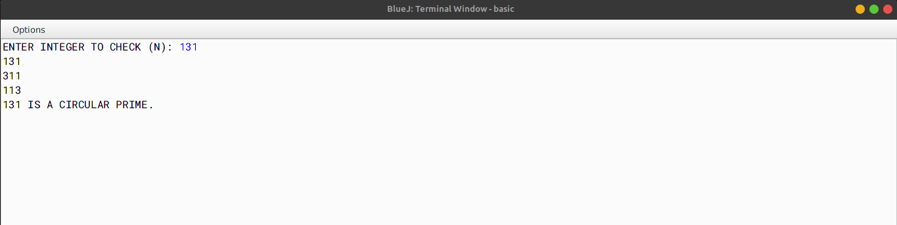

# ALGORITHM

- Step-1 :- START
- Step-2 :- Create a class named as `circular_prime`.
- Step-3 :- Create a method named as `is_prime` and pass a parameter `num`. In this function, check whether the number is prime or not.
- Step-4 :- Create a method named as `getDigitCount` and pass a parameter `num`. The function returns the number of digits in the number.
- Step-5 :- Create a method named as `main`. In this function, take a number as input from the user using Scanner Class. Now check for the invalid input. If the input is invalid, then print the message `Invalid Input`. Now check whether the number is prime or not. If the number is prime, then check whether the number is circular prime or not. If the number is circular prime, then print the number in the rotated forms. If the number is prime even after rotating, then print the message `Circular Prime`. If the number is not prime, then print the message `Not a Prime Number`.
- Step-6 :- END

# VD TABLE

| Sr. No. | Variable | Data Type | Description |
| --- | --- | --- | --- |
| 1 | n | int | To store the number |
| 2 | num | int | To store the number |
| 3 | digitCount | int | To store the number of digits in the number |
| 4 | n2 | int | To store the copy of the original number |
| 5 | divisor | int | To store the remainder |
| 6 | isCircularPrime | boolean | To store the boolean value |
| 7 | t1 | int | Used as a temporary variable |
| 8 | t2 | int | Used as a temporary variable |
| 9 | i | int | Used as loop variable |

# OUTPUT

