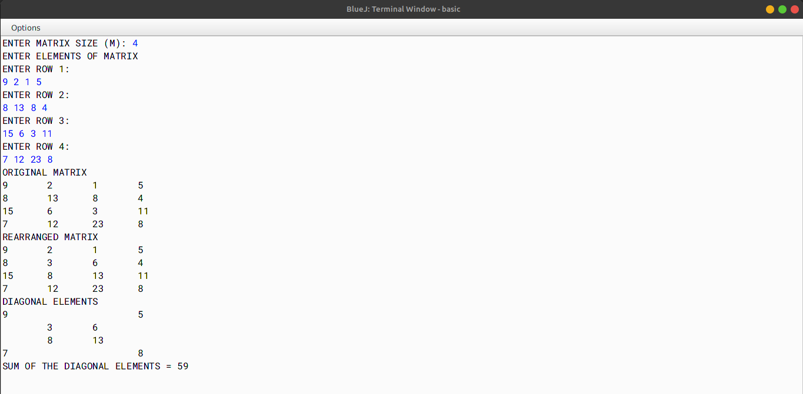

# ALGORITHM

- Step-1 :- START
- Step-2 :- Create a class named as `rearrange`.
- Step-3 :- Create a method named as `sortNonBoundaryMatrix` passing an array and an integer as parameters. In this function, sort the non-boundary elements of the matrix in ascending order by first converting the 2D array into 1D array and then sorting it and then again transferring in to 2D array.
- Step-4 :- Create a method named as `computePrintDiagonalSum` passing an array and an integer as parameters. In this function, compute the sum of the diagonal elements of the matrix and print the final sum.
- Step-5 :- Create a method named as `printMatrix` passing an array and an integer as parameters. In this function, print the matrix.
- Step-6 :- Create a method named as `main`. In this function, input the size of the matrix and the elements of the matrix from the user using the Scanner class. Then, call the `sortNonBoundaryMatrix` function and then the `computePrintDiagonalSum` function and finally call the `printMatrix` function.
- Step-7 :- END

# VD TABLE 

| Sr. No. | Variable | Data Type | Description |
| --- | --- | --- | --- |
| 1 | m | int | To store the size of the matrix |
| 2 | a | int[][] | Array to store the elements of the matrix |
| 3 | i | int | Loop variable |
| 4 | j | int | Loop variable |
| 5 | t | int | Temporary variable to store the elements of the matrix |
| 6 | sum | int | To store the sum of the diagonal elements of the matrix |
| 7 | k | int | Temporary Variable |
| 8 | b | int[] | Array to store the elements of the matrix (1D Format) |

# OUTPUT

