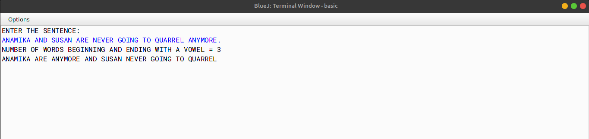

# ALGORITHM

- Step-1 :- START
- Step-2 :- Create a class named as `vowel`.
- Step-3 :- Create a method named as `isVowel` and pass a character as a parameter. In this function, check if the character is a vowel or not.
- Step-4 :- Create a method named as `main`. In this function, input the sentence from the user using Scanner class. Now check whether the sentence is valid or not. Now place the words which begin and end with a vowel at the beginning, followed by the remaining words as they occur in the sentence. Print the sentence and number of words beginning and ending with a vowel.
- Step-5 :- END

# VD TABLE

| Sr. No. | Variable | Data Type | Description |
| --- | --- | --- | --- |
| 1 | ipStr | String | To store the sentence |
| 2 | word | String | To store the words |
| 3 | str | char | To store the trimed sentence |
| 4 | c | int | Used as counter variable |
| 5 | wordLen | int | To store the length of each word |
| 6 | newStr | String | To store the changed sentence |
| 7 | len | int | To store the length of the sentence |

# OUTPUT

