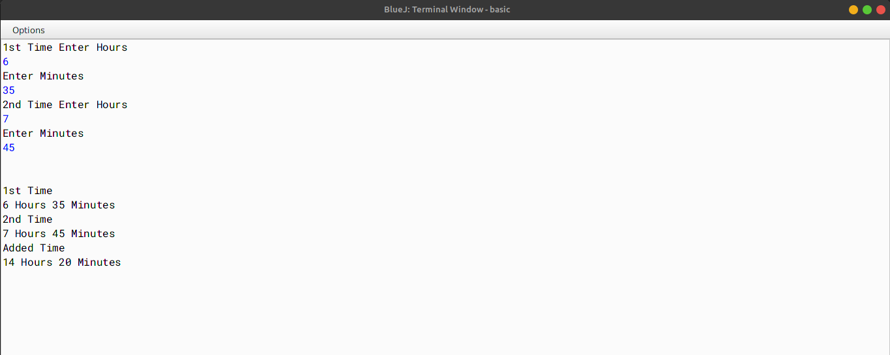

# ALGORITHM

- Step-1 :- START 
- Step-2 :- Create a class named as `Adder`.
- Step-3 :- Declare an array of type interger.
- Step-4 :- Create a constructor named as `adder`. In this constructor, initialize the array with size `2`.
- Step-5 :- Create a method named as `readtime`. In this function, take the time input from the user using Scanner class.
- Step-6 :- Create a method named as `add` passing two parameterised objects `X` and `Y`. In this function, adds the time of the two parameterized objects `X` and `Y` and stores the sum in the current calling object.
- Step-7 :- Create a method named as `display`. In this function, display the time.
- Step-8 :- Create a method named as `main`. In this function, create two objects of the class `Adder` and call the methods.
- Step-9 :- END

# VD TABLE

| Sr. No. | Variable | Data Type | Description |
| --- | --- | --- | --- |
| 1 | a | int[] | To store the time |
| 2 | a | int | To store the hour |
| 3 | b | int | To store the minute |
| 4 | c | int | To store the addition of time of the two objects |

# OUTPUT

