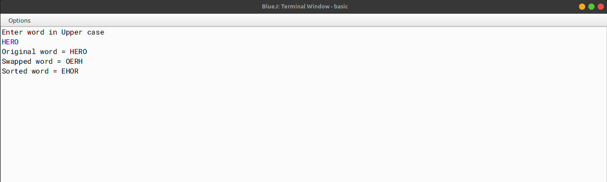

# ALGORITHM

- Step-1 :- START
- Step-2 :- Create a class named as `SwapSort`.
- Step-3 :- Declare `wrd` to store a word, `len` integer to store length of the word, `swapwrd` to store the swapped word, `sortwrd` to store the sorted word.
- Step-4 :- Create a contrustor named as `SwapSort` to initialize data members with legal initial values.
- Step-5 :- Create a method named as `readword` to accept a word in UPPER CASE.
- Step-6 :- Create a method named as `swapchar` to interchange/swap the first and last characters of the word in `wrd` and stores the new word in `swapwrd`.
- Step-7 :- Create a method named as `sortchar` to sort the characters of the word in `swapwrd` and stores the new word in `sortwrd`.
- Step-8 :- Create a method named as `main` to create an object and call the functions accordingly to enable the task.
- Step-9 :- END

# VD TABLE

| Sr. No. | Variable | Data Type | Description |
| --- | --- | --- | --- |
| 1 | wrd | String | To store a word |
| 2 | len | int | To store length of the word |
| 3 | swapwrd | String | To store the swapped word |
| 4 | sortwrd | String | To store the sorted word |
| 5 | i | int | To store the index of the word |
| 6 | j | int | To store the index of the word |
| 7 | c | char | To store the temporary character |

# OUTPUT

