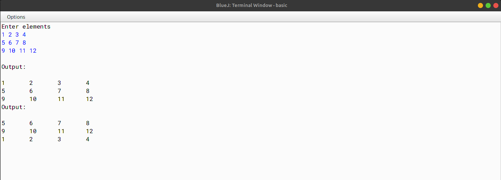

# ALGORITHM

- Step-1 :- START
- Step-2 :- Create a class named as `Shift`.
- Step-3 :- Declare variables - `mat[ ][ ]` to stores the array elements, `m` to store the number of rows and `n` to store the number of columns.
- Step-4 :- Create a constructor named as `Shift` with two integer type intergers, to initialize the variables to initialize the data.
- Step-5 :- Create a method named as `input` to input the elements of the array.
- Step-6 :- Create a method named as `cyclic` to enable the matrix of the `object(P)` to shift each row upwards in a cyclic manner and store the resultant matrix in the current object.
- Step-7 :- Create a method named as `display` to display the elements of the array.
- Step-8 :- Create a method named as `main` to create an object of the class `Shift` and call the methods.
- Step-9 :- END

# VD TABLE

| Sr. No. | Variable | Data Type | Description |
| --- | --- | --- | --- |
| 1 | mat[ ][ ] | int | To store the array elements |
| 2 | m | int | To store the number of rows |
| 3 | n | int | To store the number of columns |
| 4 | i | int | To store the row number |
| 5 | j | int | To store the column number |
| 6 | mm | int | To store the number of rows inside the constructor - `Shift` |
| 7 | nn | int | To store the number of columns inside the constructor - `Shift` |

# OUTPUT

